 

  

 

<table>
<tr>
<td width="33%" valign="top">

**⚙️ Building**

Automation tooling for the Pterodactyl game-server ecosystem, in Go, Node.js, and Bash.

</td>
<td width="33%" valign="top">

**📚 Studying**

Computer Science and Business Systems, plus cloud and infrastructure on the side.

</td>
<td width="33%" valign="top">

**🎯 Focus**

Clean interfaces on top, automated and reliable infrastructure underneath.

</td>
</tr>
</table>

 

## Stack

<picture>
  <source media="(prefers-color-scheme: light)" srcset="https://skillicons.dev/icons?i=go,bash,py,js,ts,nodejs,react,graphql&theme=light&perline=8" />
  
</picture>
 
<picture>
  <source media="(prefers-color-scheme: light)" srcset="https://skillicons.dev/icons?i=docker,kubernetes,terraform,ansible,githubactions,gitlab,git&theme=light&perline=7" />
  
</picture>
 
<picture>
  <source media="(prefers-color-scheme: light)" srcset="https://skillicons.dev/icons?i=aws,gcp,digitalocean,linux,ubuntu,nginx,prometheus,grafana,redis,postgres,mysql,mongodb&theme=light&perline=12" />
  
</picture>

 

## Projects

<table>
<tr>
<td width="50%">

</td>
<td width="50%">

</td>
</tr>
<tr>
<td width="50%">

</td>
<td width="50%">

</td>
</tr>
</table>

 

## Activity

<picture>
  <source media="(prefers-color-scheme: dark)" srcset="https://raw.githubusercontent.com/XxidHosT/XxidhosT/output/github-snake-dark.svg" />
  <source media="(prefers-color-scheme: light)" srcset="https://raw.githubusercontent.com/XxidHosT/XxidhosT/output/github-snake.svg" />
  
</picture>

 

